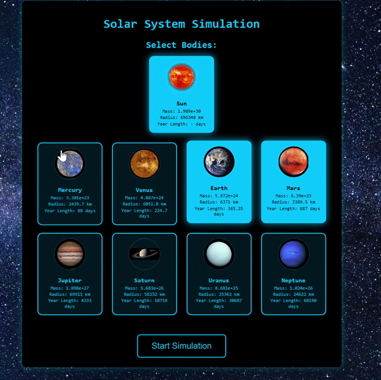
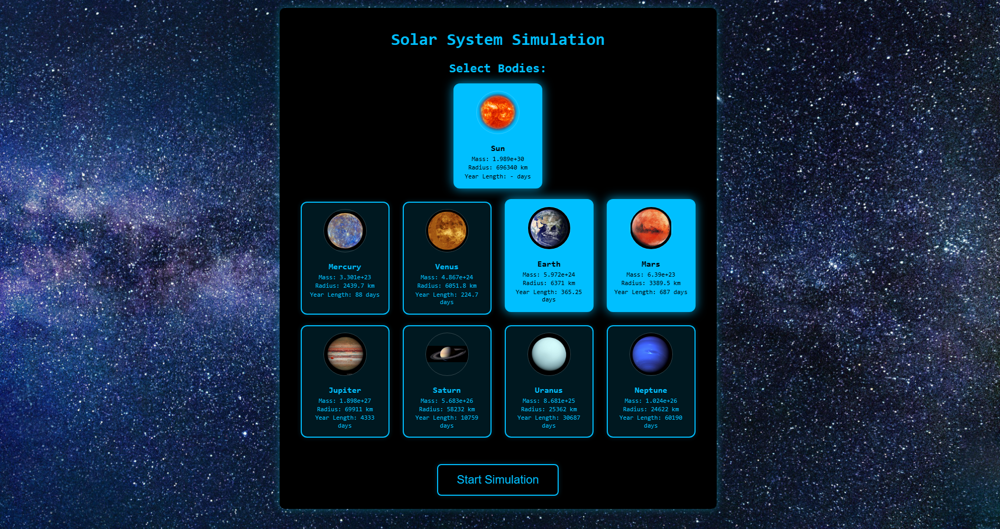
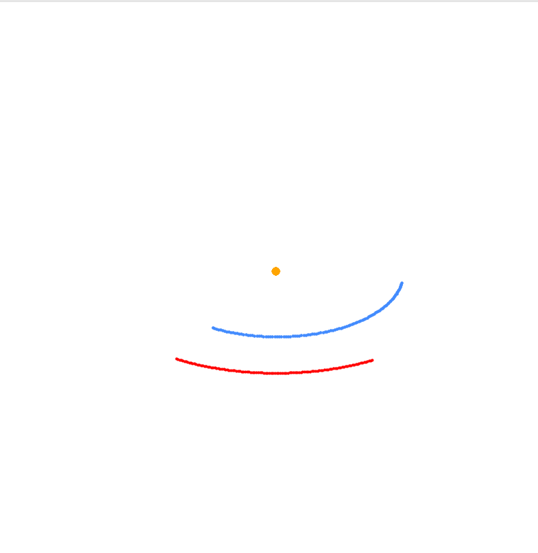
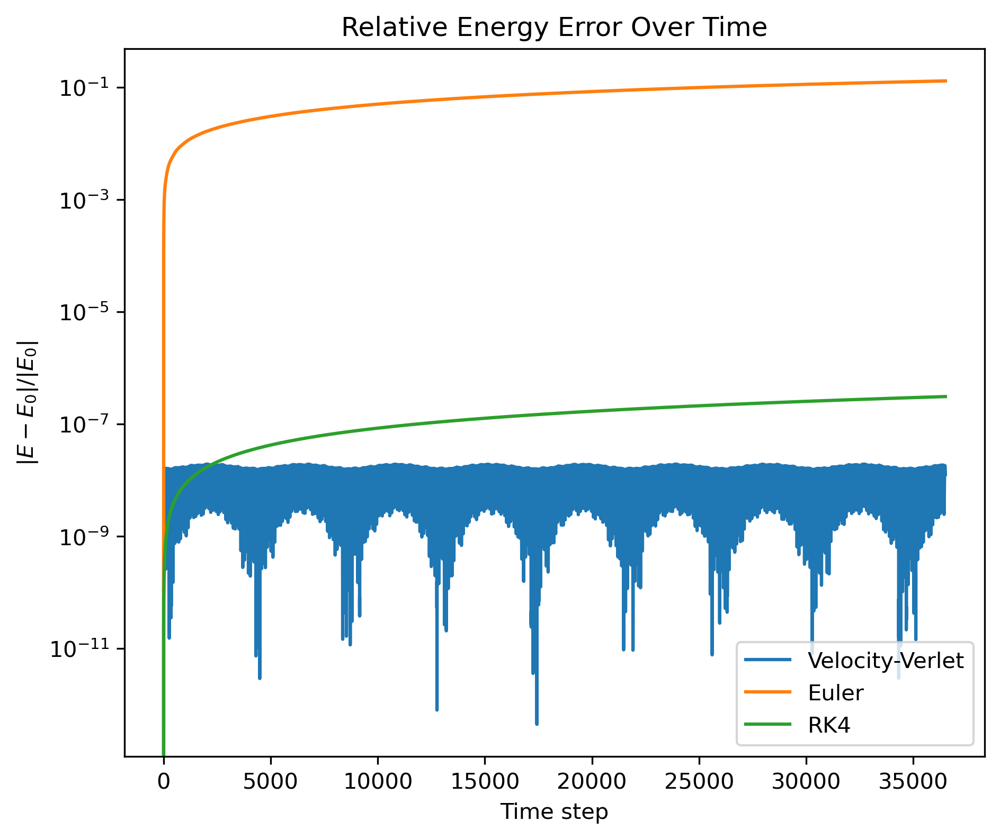
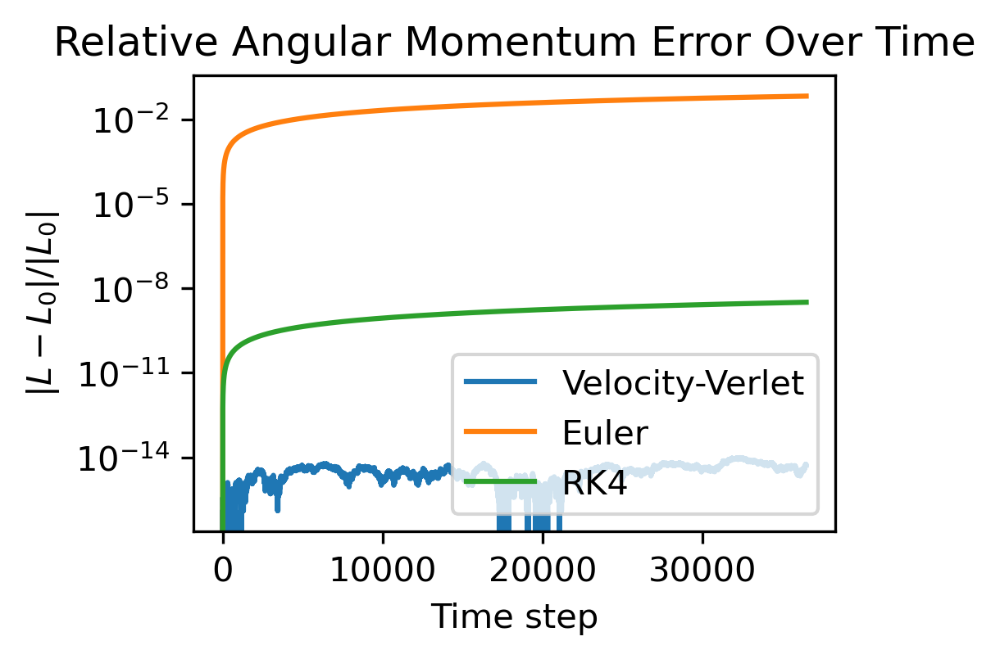
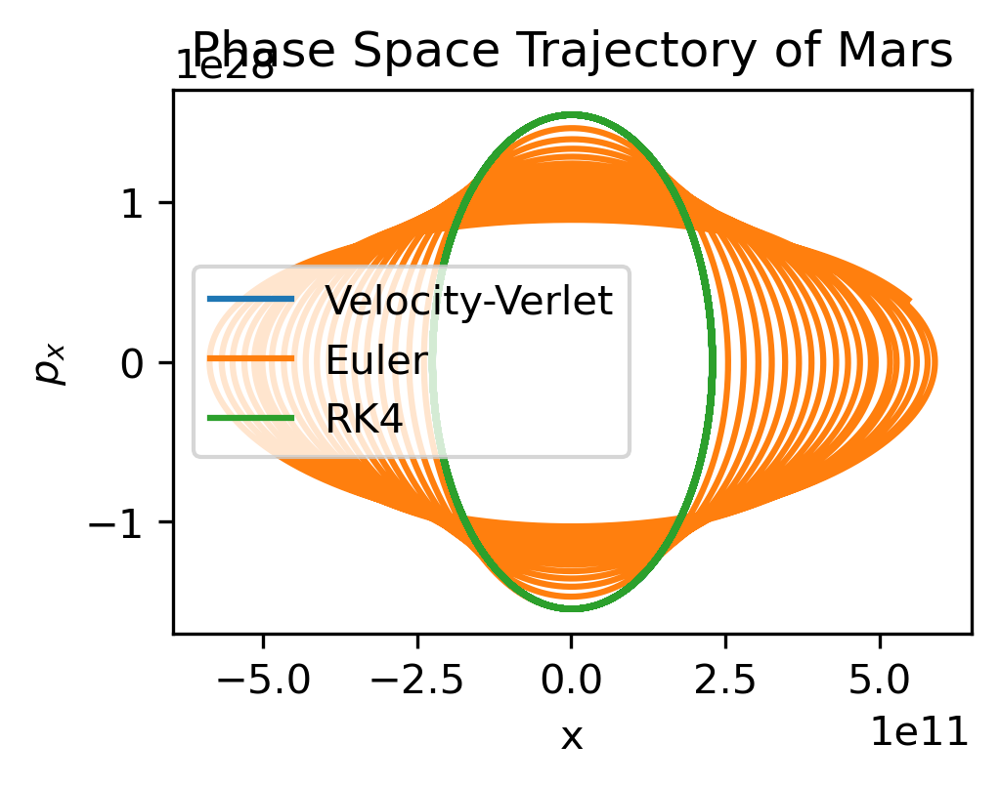

# Orbit2.0 

[](https://opensource.org/licenses/MIT)
[](https://www.python.org/)

A modular, minimalistic, and physically accurate orbital simulator.  
Experience as a modern interactive web app or classic desktop Python/matplotlib animation. Powered by symplectic Velocity-Verlet integration, Flask, and vanilla JS.

---

## Table of Contents

- [Overview](#overview)
- [Screenshots / GIFs](#screenshots--gifs)
- [Features](#features)
- [Architecture](#architecture)
- [Quickstart](#quickstart)
- [Editing or Adding Bodies](#editing-or-adding-bodies)
- [What's New in 2.0](#whats-new-in-20)
- [Numerical Analysis](#numerical-analysis)
- [Future Work](#future-work)
- [Known Issues](#known-issues)
- [Contributing](#contributing)
- [License](#license)
- [Credits](#credits)

---

## Overview

Orbit2.0 simulates orbital motion using **energy-conserving Velocity-Verlet integration** for long-term orbital stability. Built around a lightweight, performance-focused architecture designed for clarity, efficiency, and a seamless user experience while avoiding unnecessary complexity.

**Experience it as:**

- **Desktop:** Python + 3D Matplotlib animation (for research, teaching, or offline demos).
- **Web:** Flask backend + HTML/JS/CSS frontend (modern interactive 2D simulation).

Both interfaces use the **same NumPy-based simulation core** for scientific consistency.

---

## Screenshots / GIFs

<p align="center">
  
  <br>
  <em>Web demo</em>
</p>

<p align="center">
  
  <br>
  <em>Body Selection Screen</em>
</p>

<p align="center">
  
  <br>
  <em>Matplotlib simulation</em>
</p>

---

## Features

### Physics Engine

- Symplectic **Velocity-Verlet integration** (replaces semi-implicit Euler), numerically stable for long-term orbits.
- Planetary/body data stored in **editable `bodies.json`**.

### Web / UI

- Dynamic body selection via interactive cards.
- Real-time Canvas animation with **buffering and interpolation**.
- **Server-Sent Events (SSE)** for low-latency updates.
- Play/Pause toggle, zoom in/out, configurable trails, starry background, and auto pause on tab change.

### Backend & Architecture

- Modular OOP physics core (**sim.py**).
- Flask backend serves snapshots to web; Matplotlib mode remains fully supported.

### Other

- Fully responsive design for desktop & mobile.
- Clean separation of **code, data, and UI** for maintainability.
- Open-source.

---

## Quickstart

### Clone & Install

```
git clone https://github.com/Root3141/Orbit.git
cd Orbit
pip install -r requirements.txt
```

### Run Web App

```
python app.py
```

Open http://localhost:5000
or view the live demo [here](https://weborbitsim.onrender.com/)↗.

### Desktop (Matplotlib) Mode

```
python sim.py
```

## Architecture

```
   [bodies.json]
        |
+---------------------+
|   simulation.py     |  <-- Shared simulation engine (NumPy + Verlet)
+---------------------+
      |            |
[Matplotlib]  [Flask backend/API]
                   |
             [HTML/JS frontend]
```

## Editing or Adding Bodies

All celestial object data lives in **`bodies.json`**.  
Add, remove, or edit entries - changes are reflected instantly in both interfaces.

---

## What's New in 2.0

| Feature       | v1.0                | v2.0 (Current)                              |
| ------------- | ------------------- | ------------------------------------------- |
| Integration   | Semi-implicit Euler | Velocity-Verlet |
| Data          | Hardcoded           | Editable JSON file                    |
| Visualization | Matplotlib only     | Web + Matplotlib               |
| Architecture  | Flat script         | Modular, shared core, clean separation      |
| UI/UX         | Static plots        | Modern, animated, interactive web UI        |


---

## Numerical Analysis

In orbital simulation, small numerical errors may lead to long-term drift in energy and angular momentum, leading to orbits drifting off or causing false precession. To counter that, Orbit uses Velocity-Verlet integration which is a symplectic integration method (meaning it preserves the qualitative structure of the symplectic manifold, leading to bounded long-term errors in conserved quantities), resulting in bounded errors in energy and angular momentum rather than secular drift. To evaluate this, the engine was benchmarked against Euler and RK4 integrators.

### Energy Conservation
While Velocity-Verlet remains closely bounded and oscillates around the initial energy state, the other methods exhibit secular drift.

<p align="center">
  
  <br>
  <em>Log-scale plot of relative energy error</em>
</p>

### Angular Momentum Conservation
By preserving the symmetry of the central force field, the Velocity-Verlet engine maintains angular momentum precision several orders of magnitude higher than standard integrators.
<p align="center">
  
  <br>
  <em>Log-scale plot of relative angular momentum error</em>
</p>

### Phase Space
Since Velocity-Verlet is symplectic, it preserves phase space volume, resulting in closed orbits in phase space over long simulations, while Euler catastrophically spirals and RK4 slowly drifts (despite higher computing costs).
<p align="center">
  
  <br>
  <em>Phase Space trajectory of Mars</em>
</p>

> [!TIP]
> For further details, see the [analysis notebook](notebook/analysis.ipynb).
---

## Future Work

- Modularize frontend JS/CSS for maintainability
- Expose user-configurable options (timestep, colors, trail memory)
- Expand `bodies.json` to include moons, comets, dwarf planets
- Optional: Web Workers/WebGL support for performance
- Add multi-user support

---

## Known Issues

- On the deployed web version (Render), resuming a paused simulation may occasionally jump ahead instead of continuing from the pause point before proceeding smoothly. This does **not** occur when running locally, where it resumes as expected.

---

## Contributing
Pull requests are welcome!  
For major changes, please open an issue first to discuss what you’d like to improve.

## License

[MIT License](LICENSE)

---

## Credits

Developed by **[Aaryan Aaloke](https://github.com/Root3141)**
