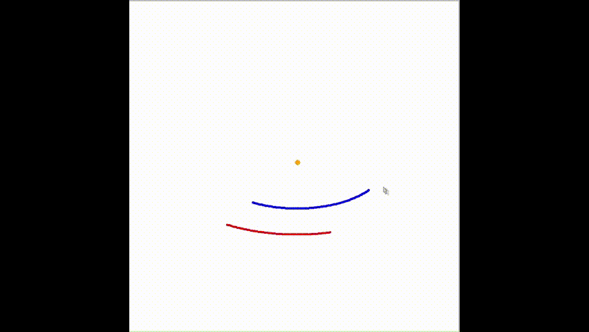

# Solar System Simulation

This is a simple 3d simulation of solar system developed in Python, leveraging the scientific computing capability of Numpy and 3d visualisation with Mathplotlib.  
The interaction is modelled under Newtonian gravity using **semi-implicit Euler method**. The symplectic nature of this method enhances numerical stability and conserves energy of the system.

## Demo

